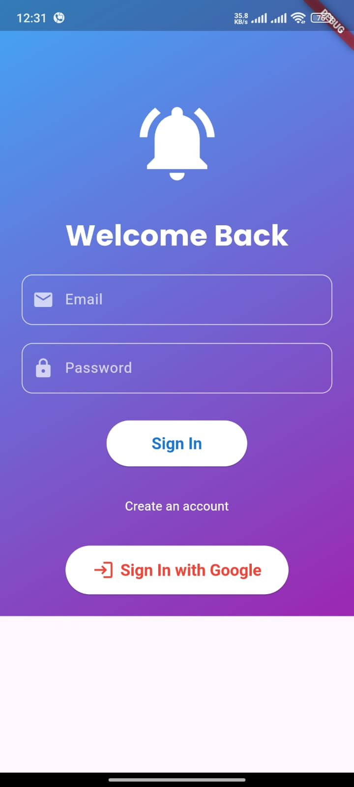
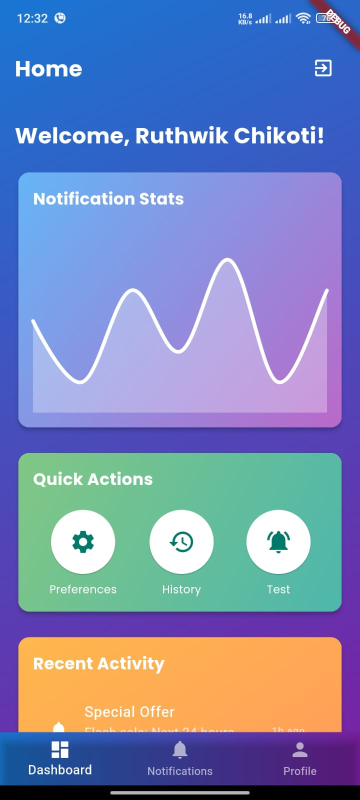
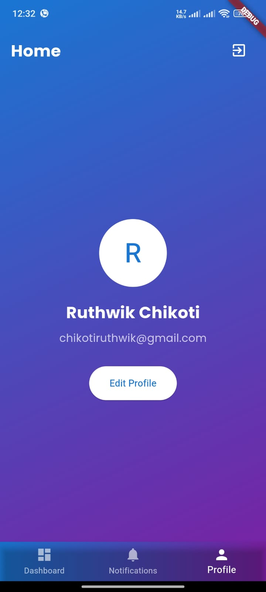
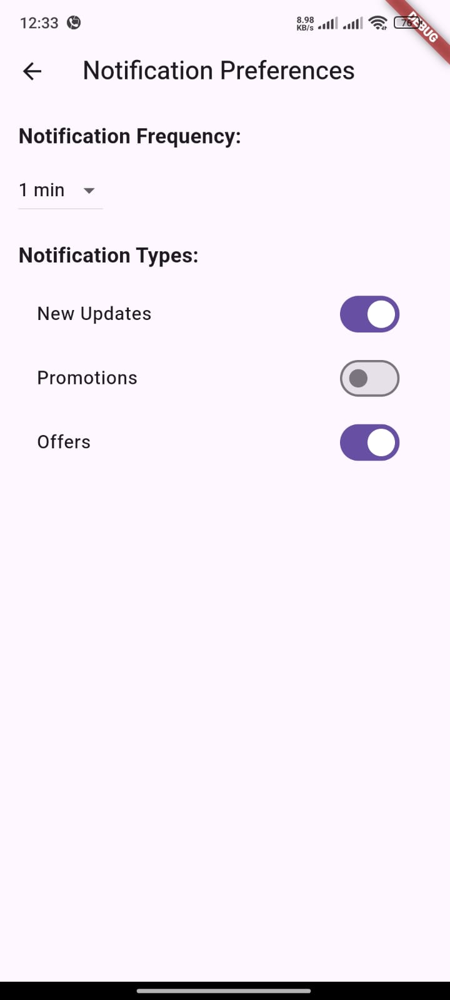
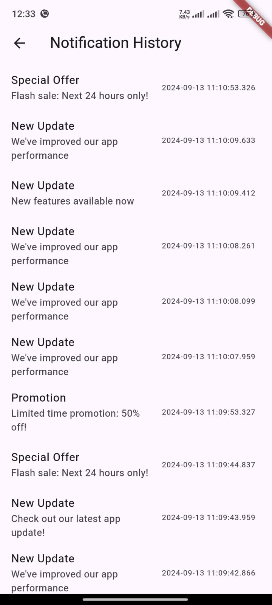
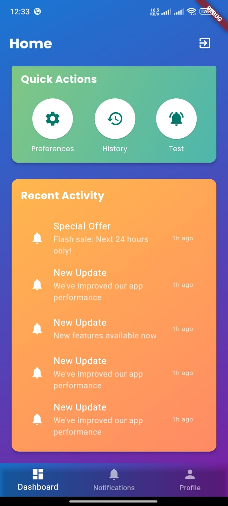

# Flutter Firebase Notification App

## Table of Contents
1. [Introduction](#introduction)
2. [Features](#features)
3. [Prerequisites](#prerequisites)
4. [Setup](#setup)
   - [Flutter Setup](#flutter-setup)
   - [Firebase Setup](#firebase-setup)
5. [Project Structure](#project-structure)
6. [Running the App](#running-the-app)
7. [Testing Push Notifications](#testing-push-notifications)
8. [Architecture and Design Choices](#architecture-and-design-choices)
9. [Future Enhancements](#future-enhancements)
10. [Troubleshooting](#troubleshooting)
11. [Contributing](#contributing)
12. [License](#license)

## Introduction

This Flutter application demonstrates the implementation of push notifications using Firebase Cloud Messaging (FCM). It includes user authentication, customizable notification preferences, and a rich user interface.

## Features

- User authentication (Email/Password and Google Sign-In)
- Push notifications via Firebase Cloud Messaging
- Customizable notification preferences (frequency and types)
- Real-time notification history
- Interactive dashboard with charts
- Responsive design with custom animations

## Prerequisites

Before you begin, ensure you have met the following requirements:

- Flutter SDK (version 2.12.0 or later)
- Dart SDK (version 2.12.0 or later)
- Android Studio / Xcode (for running on emulators/simulators)
- Firebase account
- Git

## Setup

### Flutter Setup

1. Clone the repository:
   ```
   git clone https://github.com/your-username/your_app_name.git
   cd your_app_name
   ```

2. Install dependencies:
   ```
   flutter pub get
   ```

### Firebase Setup

1. Create a new Firebase project in the [Firebase Console](https://console.firebase.google.com/).
2. Add an Android app to your Firebase project:
   - Package name: `com.example.your_app_name`
   - Download the `google-services.json` file and place it in the `android/app` directory.
3. Add an iOS app to your Firebase project:
   - Bundle ID: `com.example.yourAppName`
   - Download the `GoogleService-Info.plist` file and place it in the `ios/Runner` directory.
4. Enable Authentication in Firebase Console:
   - Go to Authentication > Sign-in method
   - Enable Email/Password and Google Sign-In
5. Set up Cloud Firestore:
   - Go to Firestore Database
   - Create a database in test mode

## Project Structure
```
lib/
├── firebase_options.dart  // Firebase configuration options
├── main.dart              // Entry point of the application
├── Screens/
│   ├── auth_screen.dart           // User authentication screen
│   ├── home_screen.dart           // Main dashboard screen
│   ├── notification_history_screen.dart  // Display notification history
│   └── preferences_screen.dart    // User notification preferences
└── Services/
    ├── auth_service.dart          // Handles user authentication
    └── notification_service.dart  // Manages push notifications

``` 

## Running the App

To run the app, use the following command:

```
flutter run
```

## Testing Push Notifications

1. Run the app on a physical device or emulator.
2. Sign in to the app.
3. Go to the Preferences screen and set your desired notification types and frequency.
4. Use the "Test" button in the Quick Actions section of the Home screen to trigger a notification.
5. You should receive the notification based on your preferences.

To test Firebase Cloud Messaging:

1. Go to the Firebase Console > Cloud Messaging.
2. Send a test message to your app.
3. You should receive the notification on your device.

## Architecture and Design Choices

- **Provider for State Management**: The app uses the Provider package for efficient and scalable state management across the app.
- **Service-based Architecture**: Auth and Notification services are separated into their own classes for better modularity and testability.
- **Firebase Integration**: The app leverages Firebase for authentication, real-time database (Firestore), and push notifications (FCM) to provide a robust backend solution.
- **Custom UI Components**: The app uses custom-designed UI components and animations to enhance user experience.
- **Responsive Design**: The app is designed to work on various screen sizes and orientations.


## Troubleshooting

- **Push notifications not working**: Ensure you have the correct Firebase configuration files and that FCM is properly set up in your Firebase project.
- **Google Sign-In issues**: Check that you've added the correct SHA-1 fingerprint to your Firebase project and that Google Sign-In is enabled in the Firebase Console.
- **Build errors**: Make sure all dependencies are up to date and compatible. Run `flutter pub upgrade` to update packages.


## ScreenShots

- Login Page


- Home Page


- Profile Page


- Preferences Page


- History Page


- Recent Notification Activity


